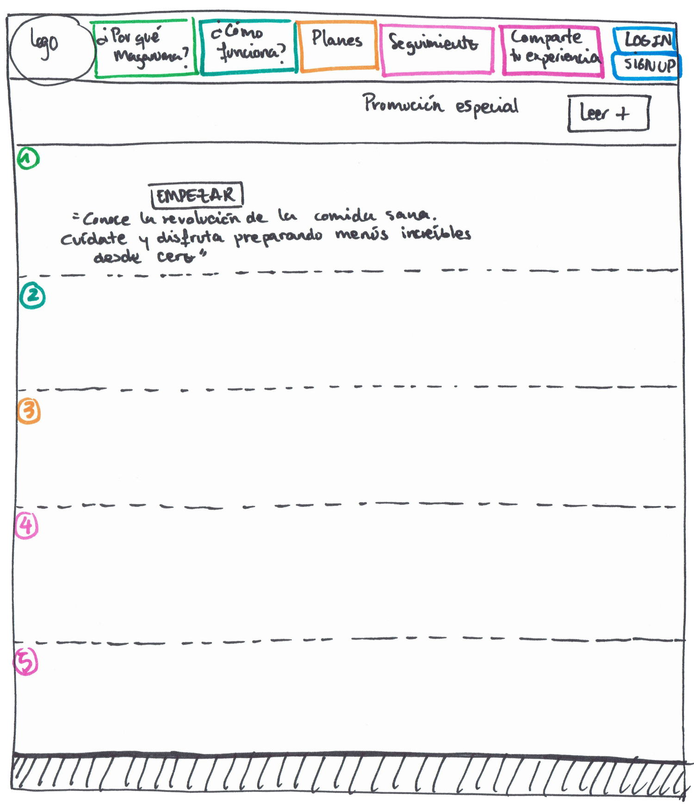

# MAGARUMA
## Decripción del proyecto
Esta será la web sobre la que aterricen los usuarios interesados en contratar el producto que ofrece 'Magaruma'. Se trata de un servicio de que facilita a sus suscriptores el acceso a una dieta bien planificada, en poco tiempo y con poco esfuerzo. Las ventajas que ofrece son las siguientes:

- Pensamos menús saludables y sabrosos
- Hacemos la compra por el usuario
- Preparamos las recetas y sus ingredientes
- Lo entregamos listo para disfrutar

Magaruma es el nombre del proyecto que estoy realizando para el Programa Superior de Marketing Digital que curso actualmente en The Valley. El objetivo del mismo es aplicar todos los conocimientos que hemos ido adquiriendo durante el curso para finalmente exponerlo ante un Tribunal.

Como parte de un mismo trabajo, estoy desarrollando la Web en la que me gustaría volcar todo lo que estoy aprendiendo en el Curso de Desarrollo Web Front-end organizado por la E.O.I. y el Programa de Garantía Juvenil del que soy beneficiaria.

El nombre y el logotipo son provisionales y están pendientes de ser aprobados por el resto de participantes del proyecto.
## Perfiles de usuario
| Descripción | Enlaces | Observaciones |
|-------------|---------|---------------|
|    Proyecto |https://macaperez.github.io/landingpage/ |Repositorio|
|    GitHub   |https://github.com/MacaPerez  | Mi perfil en GitHub |
|    Trello   |https://trello.com/b/gGHNrypl/proyecto-eoi |Tablero del proyecto|
|    CodePen  |https://codepen.io/MacaPerez/ | Mi perfil en CodePen|
|    Facebook | https://www.facebook.com/somosmagaruma/   | Perfil en Facebook|
|Twitter      | https://https://twitter.com/somosmagaruma | Perfil en Twitter|
|Instagram    |https://www.instagram.com/somosmagaruma/?hl=es | Prefil en Instagram |

## Herramientas Utilizadas
Este es el listado de herramientas que se han utilizado en todas las fases del proyecto:
- Trello: https://trello.com/
- Taylor Brands: https://studio.tailorbrands.com/brands/saved
- Photoshopen: http://photoshopen.blogspot.com
- CodePen: https://codepen.io/dashboard/
- Atom: https://atom.io/
- Draw io: https://www.draw.io/
- Place Holder it: https://placeholder.com/
- Font CDN: https://fontcdn.org/
- Google Fonts: https://fonts.google.com/

## Fase 1: Boceto inicial de la página

