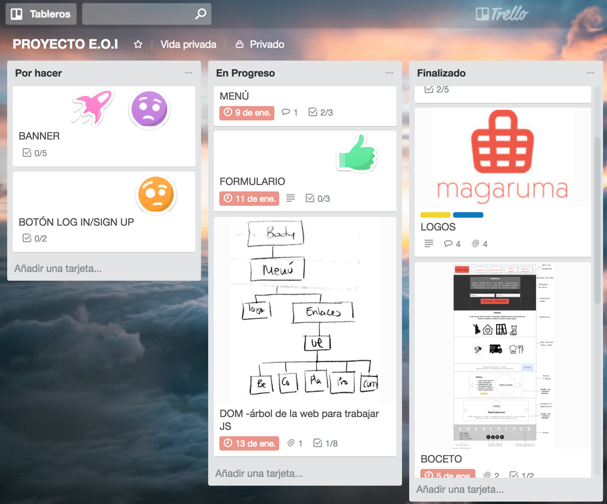

# MAGARUMA
## Decripción del proyecto
Esta será la web sobre la que aterricen los usuarios interesados en contratar el producto que ofrece 'Magaruma'. Esta Langing Page servirá como plantilla dinámica. La idea es que las imágenes y mensajes se adapten al perfil de la persona que llegue a dicha página con el objetivo de conseguir el mayor número posible de LEADS.

El servicio requiere una fase previa de validación antes de empezar a aumetar la Base de Datos.

Se trata de un servicio que facilita a sus suscriptores el acceso a una dieta bien planificada, en poco tiempo y con poco esfuerzo. Las ventajas que ofrece son las siguientes:

- Pensamos menús saludables y sabrosos
- Hacemos la compra por el usuario
- Preparamos las recetas y sus ingredientes
- Lo entregamos listo para cocinar y disfrutar
- Enseñamos a los usuarios a comer bien

Magaruma es el nombre de otro proyecto que comenzó en el PSMDB en 'The Valley'. El objetivo de desarrollar esta Landig Page es aplicar todos los conocimientos que hemos ido adquiriendo durante el curso de Desarrollo Web Front-end organizado por E.O.I. y finalmente exponerlo.

El nombre y el logotipo son provisionales y están pendientes de ser aprobados por el resto de participantes del proyecto.
## Perfiles de usuario
| Descripción | Enlaces | Observaciones |
|-------------|---------|---------------|
|    Proyecto |https://macaperez.github.io/landingpage/ |Repositorio|
|    GitHub   |https://github.com/MacaPerez  | Mi perfil en GitHub |
|    Trello   |https://trello.com/b/gGHNrypl/proyecto-eoi |Tablero del proyecto|
|    CodePen  |https://codepen.io/MacaPerez/ | Mi perfil en CodePen|
|   Linkedin  | https://www.linkedin.com/in/maca-perez | Mi perfil en Linkedin |
|    Facebook | https://www.facebook.com/somosmagaruma/   | Perfil Magaruma en Facebook|
|Twitter      | https://https://twitter.com/somosmagaruma | Perfil Magaruma en Twitter|
|Instagram    |https://www.instagram.com/somosmagaruma/?hl=es | Prefil Magaruma en Instagram |

## Herramientas genéricas utilizadas
Este es el listado de herramientas que se han utilizado en todas las fases del proyecto

|       Nombre     |         Enlaces       |      Descripción     |
|------------------|-----------------------|----------------------|
|       GIT        | https://git-scm.com/  | Sistema de Control de Versiones |
|    GIT HUB       |https://github.com/    | Plataforma y Red Social para alojar proyectos utilizando el sistema de control de versiones Git |
|       Trello     | https://trello.com/              | Para organizar el fujo trabajo |
|     CodePen      | https://codepen.io/dashboard/   | Para pruebas con CSS|
|       Atom       | https://atom.io/                | Editor de texto     |
|       LESS       | http://lesscss.org/             | "less-postcss-autocompile" Plugging de Atom para simplficar el código CSS.Se usará en una versión más avanzada |
|       PUG        | https://pugjs.org/api/getting-started.html | "autocompiler-pug-jade" Pluggig en Atom para simplificar el código HTML. Se usará en una versión más avanzada|
|      Haroopad    |http://pad.haroopress.com/       |Editor de Markdown con chuleta|
|Google Search Console|https://www.google.com/webmasters/tools/ | Herramienta para supervisar el SEO |
|Google Analytics | https://analytics.google.com/analytics/ |Para analizar tráfico y perfil de usuario que visita la página | 
|MailChimp        | https://mailchimp.com/ | Proveedor de servicios Mail Marketing con el que estamos registrando los datos de nuestro Formulario |

## Herramientas de Imágenes
|      Nombre   |     Enlaces   | Descripción | Tipo de licencia |
|---------------|---------------|-------------|------------------|
| Tailor Brands | https://studio.tailorbrands.com/| Para diseñar logotipos | FREE |
|     Gravit    | https://designer.gravit.io/     | Aplicación de diseño de vector libre| FREE |
|    Pixlr      | https://pixlr.com/editor/|Editor de imágenes on-line|FREE|
|   Draw io     | https://www.draw.io/            | Para dibujar diagramas y bocetos| FREE |
| Place Holder it | https://placeholder.com/      | Herramientas de representación de imágenes desde servidor| FREE |
| FireShot | [https://chrome.google.com/webstore..](https://chrome.google.com/webstore/category/extensions?hl=es) |  Extensión de Chrome para hacer capturas de pantalla| FREE |
|Favicon Generator |https://realfavicongenerator.net/ | Generador de Favicons para múltiples plataformas, SO y dispositivos| FREE |
| PEXELS           |https://www.pexels.com/          | Galería de imágenes de licencia libre y de pago| FREE |
| Flaticon | https://www.flaticon.com/     | Iconos en vectores con distintos formatos | CREATIVE COMMONS |

## Herramientas para tipofrafías

|      Nombre      |         Enlaces          |     Descripción       |
|------------------|--------------------------|-----------------------|
|    Font CDN      | https://fontcdn.org/     | Para descargar tipografías. Se utilizaron: DOSIS, RUBIK y MONSERRAT|
| Fontawsome       | https://fontawesome.com/icons| Iconos en vectores |

## Librerías Utilizadas

|      Nombre     |         Enlaces          |     Descripción       |
|-----------------|--------------------------|-----------------------|
|    FullPage     | https://alvarotrigo.com/fullPage/ | Para mostrar cada sección en la parte visible de la página al hacer Scroll |
| Slick Slider    | http://kenwheeler.github.io/slick/| Utilizado para el 'Carrousel' en los platos de comida y testimonios |
| jQery Cookiebar | https://www.primebox.co.uk/projects/jquery-cookiebar/ | Utilizada para  añadir aviso de Cookies y Política de Privacidad |
| mc-validator de MailChimp | [https://kb.mailchimp.com/](https://kb.mailchimp.com/es/getting-started/getting-started-with-mailchimp) | Para enlazar nuestro Formilario con MailChimp |

## Referencias

|         Enlaces                   |            Observaciones         |
|-----------------------------------|----------------------------------|
|https://www.purplecarrot.com/      |Organización de la oferta - landind page/ Efecto 'cambiar plato' - librería (blablabla)|
|https://foodinthebox.com/          |Distribución y secciones de la web|
|https://www.aristocrazy.com/es/Home|Estilo de menú - Responsive       |

## Fase 1: Idea inicial de la página

## Fase 2: Boceto de la página
En esta segunda fase del proyecto queda decidida la estructura de la web en una sola página. El menú muestra las opciones disponibles y cada botón dirige al usuario hasta el área en la que se encuadra la información. Se indicará al usuario en qué parte de la página está en cada momento.

|  Área modificada | Cambio realizado                   | Descripción |
|------------------|------------------------------------|-------------|
|Header            |Opciones del menú |Se modifican los nombres de      algunas secciones|
|Header			   |Botones LOG IN/SIGN UP|Se eliminan hasta decidir si serán incluídos en la web|
|Body              |Inclusión de Formulario|Se incluye un formulario junto con la propuesta de valor para captar LEADS|
|Body              |Banner con promoción inicial |Cambio de ubicación como estrategia para usuarios que no rellenen el primer formulario|
|Footer            |Link building                |Se incluyen enlaces internos y externos como parte de la estrategia para SEO|

## Fase 3: Estructura final de la página

|  Área modificada | Cambio realizado                   | Descripción |
|------------------|------------------------------------|-------------|
|  Body            |Opciones del menú  | Se elemina la sección 'Progreso' que se añadiría en una fase más avanzada del proyecto|
| Body             | Formulario        | Se enlaza a MailChimp |
| Body             |  Sección:  Planes a Medida | Se incluye librería para el efecto Carrousel de los planes de comida |
| Body             |  Sección:  Compaarte tu experiencia | Se incluye librería para el efecto Carrousel de los testimonios |
| Footer            | Enlace al Formulario | Se añade un botón como enlace al formulario principal |
| Footer            |  Enlaces externos e internos | Incluímos enlaces a secciones en la Web, nuestras R.R.S.S. y Magazines Gastronómicos que 'hablan de nuestro producto' |
| Footer             |  Mención Licencias | Añadimos una meción a licencia de Flaticon al final del footer  |

## Cosas por hacer
* Solucionar incompatibilidad con la librería FullPage (problemas de Scroll)

